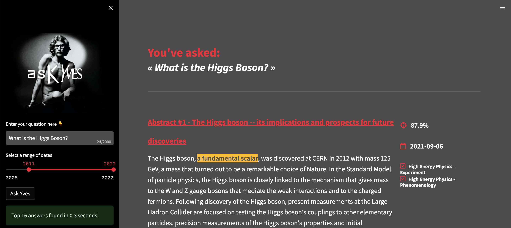

# **Ask' Yves**
<div align="center">
    <a href="https://pd-redis-redisplay-ea87d28003b046a8a3617ebdbddfdbe3.community.saturnenterprise.io/"></a>
    <br />
    <br />
<div display="inline-block">
    <a href="https://hackathon.redisventures.com/"><b>Hackathon Page</b></a>&nbsp;&nbsp;&nbsp;
    <a href="https://www.kaggle.com/datasets/Cornell-University/arxiv"><b>ArXiv dataset</b></a>&nbsp;&nbsp;&nbsp;
    <a href="https://pd-redis-redisplay-ea87d28003b046a8a3617ebdbddfdbe3.community.saturnenterprise.io/"><b>Hosted App</b></a>&nbsp;&nbsp;&nbsp;
  </div>
    <br />
    <br />
</div>


Yves Saint Laurent was one of the greatest minds of french history. He spent a lot of time reading scientific papers on arXiv.

Ask him anything. He will have an answer. Probably not the right one, but you might be surprised 😅


# **How to use the app**


Ask'Yves app allow you to ask questions to Yves, who will search for an answer in abstracts of the ArXiv database. Whenever he's found something, Yves will display a set of abstracts ranked by relevance, and highlight the answer to your question in the abstract text.

To ask a question to Yves, just fill the text prompt window on left sidebar, select a range of publication dates to retrieve abstracts from, and click on "Submit to Yves". The results will then be displayed along with information regarding the abstract: 
- Relevance score
- Publication date
- Categories

You can then access the article on arXiv by directly clicking on the article's title.

# **How to setup the app**

## **File architecture**
```
.
├── LICENSE
├── Makefile
├── README.md
├── askyves
│   ├── embedder.py
│   └── redis_document_store.py
├── assets
│   ├── app_interface.png
│   ├── askyves.png
│   └── categories.py
├── config.py
├── credentials
│   ├── env.sh.example
├── data
│   ├── README.md
│   ├── build_embeddings_multi_gpu.ipynb
│   ├── load_data_in_redis.py
│   └── requirements.txt
├── frontend
│   ├── lib
│   │   ├── __init__.py
│   │   ├── app_utils.py
│   │   └── query_utils.py
│   └── streamlit_app.py
├── pyproject.toml
├── requirements.in
├── requirements.txt
└── saturn-deployment-recipe.json
```

Project is divided into multiple folders:
- askyves/ contains files related to document embedding and document store definition
- data/ contains files related to Redis Database creation
- frontend/ contains files related to the Streamlit App

To setup the app, you'll first need to create a Redis DB containing your embedded documents. You'll then be able to launch and use the app, locally or on a Saturn Cloud instance.

## **Data and database**

### Get data from Kaggle

- You can download the Arxiv dataset from here:
    - https://www.kaggle.com/datasets/Cornell-University/arxiv

- (Recommended solution) If you have a Kaggle account:
    - go to your account and create an API key
    - put the created key in `~/.kaggle/kaggle.json`
    - then use the CLI to download the dataset:
        - `kaggle datasets download -d Cornell-University/arxiv`


### Build embeddings

- Run through the `build_embeddings_multi_gpu.ipynb` notebook on Saturn Cloud (Jupyter server + Dask Cluster) to build the embeddings.

### Load data to Redis

- Once the embeddings built:
    - You'll need to export env variable. Check `credentials/env.sh.exemple` to have the list    
    - Then, run `python data/load_data_in_redis.py`

## **Run the app locally**

**1. Setup python environment:**

Run the following command to create a virtual environment and install all requirements:
```bash
make env
make install_requirements
```

**2. Fill credentials in environment:**

You'll need to export the following variables in your environment. Check `credentials/env.sh.exemple` to have the list of variables to fill:
```bash
export REDIS_HOST="redis_host_url"
export REDIS_PORT="1234"
export REDIS_DB="your-redis-database-name"
export REDIS_PASSWORD="redis-db-password"
```

**3. Run the app locally:**
To run the app in your local environment, just run the following command:
```bash
make run_app
```

It will open a Streamlit window on your web-browser.


## **Run the app on a Saturn Cloud Deployment instance**

You can easily create a deployment instance to run your app in Saturn Cloud by copying the recipe stored in the file `saturn-deployment-recipe.json` at the root of the project. Here is the instruction to create your own instance:

1. First, you'll need to parametrize your credentials in Saturn Cloud so your instance can access them. Go to "Secrets" > "New", and create a secret for the 4 credentials variables you exported earlier.

2. Then, go to "Resources" > "New Deployment" > "Use a Recipe", and paste the content of `saturn-deployment-recipe.json` in the open window. A deployment instance will be created with app parameters.

3. Finally, you'll need to add the credentials that are necessary to run your app. After creating the instance, select it in "Resources", then go to "Secrets" > "Attach Secret Environment Variable", and select in the dropdown menu the secrets you defined in step 1. Be sure to assign corresponding environment variable name to them.

4. Now you're ready to go! Click on "Overview" > "Start", and once the app is running, you can access it by clicking on the provided public URL.

Notes: 
- The deployment instance will directly pull the main branch of this repo to run the app with, but you can modify the branch it pulls by modifying it in "Git Repos" section. 
- You may need to link a Saturn SSH key the first time you run the app, the instructions to do so will then be displayed on Saturn directly. You will just have to add Saturn SSH Key to your GitHub profile.


## **Next steps**

The app was designed in a limited amount of time, and there's obviously a lot of improvements to be made and features to explore. Here is a quick snapshot of some ideas we have:
- We used a generic embedding model for the abstracts, it may be relevant to try fine-tuned models to see if it improves similarity search performances
- Same for Q&A model, trying other models may improve question answering performances
- We currently retrieve 10 documents when the app run on CPU, and 100 if the app run on GPU, which may be short for difficult questions. It may be interesting to have an adaptative number of retrieved documents depending on the quantity of answers found for a particular question

## Interested in contributing?
This is a new project. Comment on an open issue or create a new one. We can triage it from there.

## Additional links
- [ArXiv Kaggle Dataset](https://www.kaggle.com/datasets/Cornell-University/arxiv)
- [Hackathon Page](https://hackathon.redisventures.com/)
- [MLOps Community Slack channel](https://join.slack.com/t/mlops-community/shared_invite/zt-1cjmjku5d-ZhJitSlS0VtqfCcwRpn_CQ)
- [Redis](https://redis.io/)
- [Saturn Cloud](https://saturncloud.io/)
